# **Level 1 – Basic (Foundational Skills)**

### ✔ Set up users, groups for dev team

### ✔ Manage permissions for project directories

### ✔ Install required packages (git, nginx, java)

### ✔ Check system info (memory, CPU, disks)

---

# **1. Set Up Users & Groups for Dev Team**

---

## **Create a New Group**

```bash
sudo groupadd devteam
```
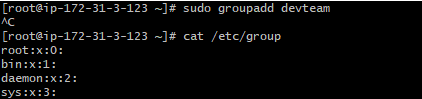

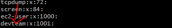


**Explanation:**
Creates a group named `devteam`.
Groups allow easy permission management for multiple users.

---

## **Create a New User**

```bash
sudo useradd john
```


**Explanation:**
Creates a user account named `john`.
Note: No home directory created yet.

---

## **Create User with Home Directory, Shell & Add to Group**

```bash
sudo useradd -m -s /bin/bash -G devteam john
```

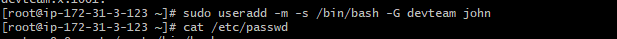

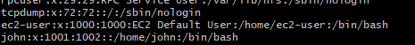


**Explanation of options:**

* **`-m`** → creates home directory `/home/john`
* **`-s /bin/bash`** → sets default shell
* **`-G devteam`** → adds user to group

This is the recommended method for dev users.

---

## **Add an Existing User to a Group**

```bash
sudo usermod -aG devteam john
```

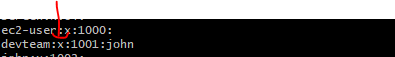


**Explanation:**
Adds user `john` to the group `devteam` without removing existing group memberships.

---

# **2. Manage Permissions for Project Directories**

---

## **Create a Project Directory**

```bash
sudo mkdir /opt/projectA
```

**Explanation:**
Creates a directory under `/opt`, commonly used for applications.

---

## **Assign Ownership to User & Group**

```bash
sudo chown john:devteam /opt/projectA
```
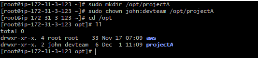


**Explanation:**
Makes **john** the owner and **devteam** the group owner of the folder.

---

## **Give Full Access to Owner & Group**

```bash
sudo chmod 770 /opt/projectA
```

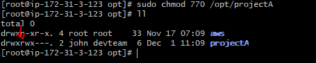

**Explanation (permissions):**

* Owner: read, write, execute
* Group: read, write, execute
* Others: no access

Suitable for private dev-team folders.

---

## **Give Read-Only Access to Others**

```bash
sudo chmod 775 /opt/projectA
```
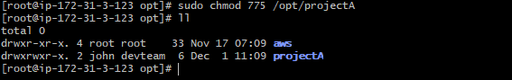


**Explanation:**

* Owner & group: full access
* Others: read + execute (can view files)

Use for public or web-accessible directories.

---

# **3. Install Required Packages (Git, Nginx, Java)**

---

## **Update Package Index**

```bash
sudo apt update -y      # Ubuntu/Debian
sudo dnf update -y      # Amazon Linux
```


**Explanation:**
Refreshes package list to install the latest versions.

---

## **Install Git**

```bash
sudo dnf install -y git
```
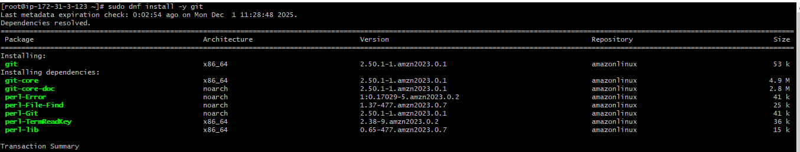


**Explanation:**
Installs Git (version control tool).

---

## **Install Nginx**

```bash
sudo apt install -y nginx
```
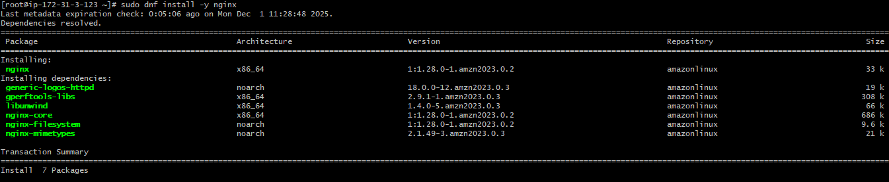

**Explanation:**
Installs Nginx web server (commonly used in DevOps).

## **Start and Enable Nginx**

```bash
sudo systemctl start nginx
sudo systemctl enable nginx
sudo systemctl status nginx

```

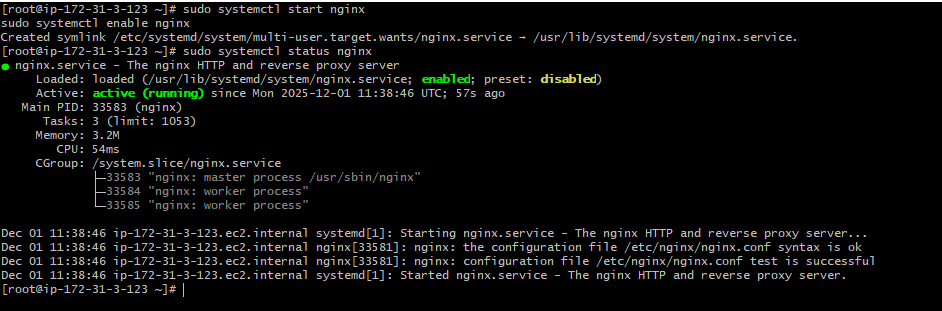

---

## **Install Java**

```bash
sudo apt install -y openjdk-11-jdk
```
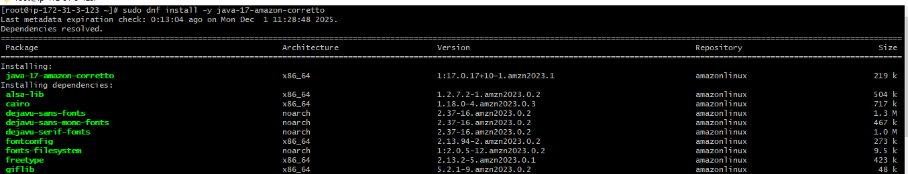

**Explanation:**
Installs Java Development Kit (JDK) version 11.

---

# **4. Check System Info (Memory, CPU, Disks)**

---

## **Check CPU Information**

```bash
lscpu
```

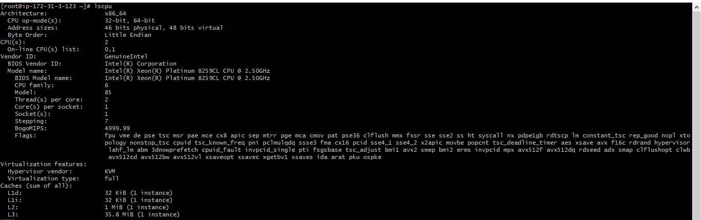

**Explanation:**
Shows CPU model, cores, threads, and architecture.

---

## **Check Memory Usage**

```bash
free -h
```
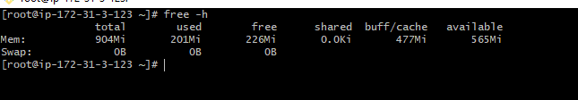

**Explanation:**
Displays RAM usage in human-readable form.

---

## **Check Disk Usage**

```bash
df -h
```
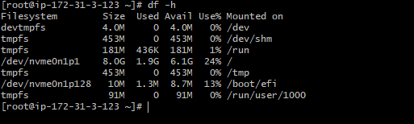

**Explanation:**
Shows mount points and free/used disk space.

---

## **List Storage Devices**

```bash
lsblk
```

**Explanation:**
Shows connected disks, partitions, and mount structure.

---

## **Check OS Version**

```bash
cat /etc/os-release
```
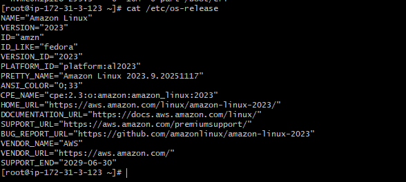

**Explanation:**
Displays Linux distribution name and version.

---


# **Level 2 – Intermediate (Daily DevOps Tasks)**

# **1. Automate Backups with Cron**

---

## **Open Crontab for Editing**

```bash
crontab -e
```

**Explanation:**
Opens the cron scheduler for the current user. You add schedules here (e.g., daily backups).

## **Schedule a Daily Backup Job (Example: backup /var/www)**

```bash
0 2 * * * tar -czf /backup/site-$(date +\%F).tar.gz /var/www/
```
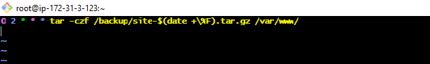

**Explanation of schedule:**

* **0 2 * * *** → runs every day at 2:00 AM
* **tar -czf** → compress folder into `.tar.gz`
* **$(date +%F)** → auto-adds today’s date

This creates daily timestamped backups.

---

## **View Scheduled Cron Jobs**

```bash
crontab -l
```
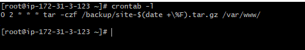

**Explanation:**
Lists all cron jobs for the current user.

---

## **Check Cron Service Status**

```bash
systemctl status cron       # Ubuntu
systemctl status crond      # RHEL/CentOS/Amazon Linux
```
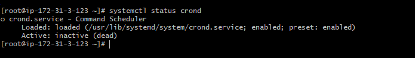

**Explanation:**
Verifies if the cron service is running or has any errors.

---

# **2. Create Shell Scripts**

---

## **Create a Script File**

```bash
nano cleanup.sh
```

**Explanation:**
Opens nano editor to create/edit a shell script.

---

## **Add Log Cleanup Script (Example)**

```bash
#!/bin/bash
find /var/log -type f -name "*.log" -mtime +7 -delete
```
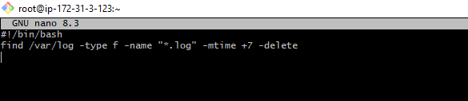

**Explanation:**
Deletes `.log` files older than **7 days** under `/var/log`.

---

## **Add Service Restart Script (Example: restart nginx if down)**

```bash
#!/bin/bash
if ! systemctl is-active --quiet nginx; then
    systemctl restart nginx
fi
```
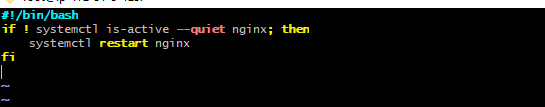

**Explanation:**

* Checks if Nginx is inactive
* If yes → automatically restarts it

Useful for production environments.

---

## **Add Health Check Script (Example: website check)**

```bash
#!/bin/bash
curl -Is http://localhost | head -n 1
```
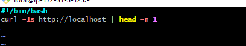

**Explanation:**
Sends a request to the local server and prints HTTP response.
You can use this to monitor website availability.

---

## **Make Script Executable**

```bash
chmod +x cleanup.sh
```

**Explanation:**
Allows the script to be run as a program.

What does +x mean? (in very simple words)

+x adds execute permission to a file.

x = execute

// + = add the permission

Before chmod +x

The script is just a normal text file — you cannot run it.

permission denied

---

## **Run the Script**

```bash
./cleanup.sh
```

**Explanation:**
Executes the script in the current directory.

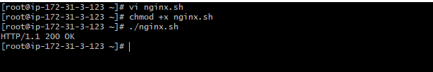

---

# **3. Manage Logs Under /var/log**

---

## **List Log Files**

```bash
ls -lh /var/log
```
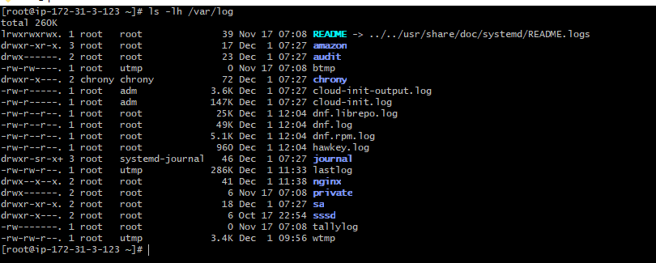

**Explanation:**
Shows all logs with sizes in human-readable format.

---

## **View Logs in Real Time**

```bash
 journalctl -f

```
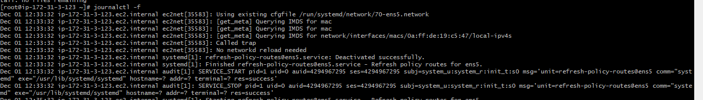

**Explanation:**
Shows live logs as new events happen.

---

## **View a Specific Log**

```bash
less /var/log/nginx/error.log
```

**Explanation:**
Useful for debugging service-specific issues (nginx, apache, ssh, etc).

---

## **Search for Errors in Logs**

```bash
grep -i "error" /var/log/syslog
```
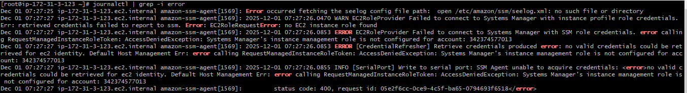

**Explanation:**
Searches logs for text like “error”, ignoring case (`-i`).

---

## **Clear a Log File Safely (Without Deleting File)**

```bash
sudo journalctl --rotate
sudo journalctl --vacuum-size=100M
```
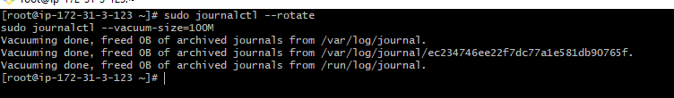

**Explanation:**
Makes log size zero but keeps permissions and file structure intact.

journalctl --rotate	Start a new log file
journalctl --vacuum-size=100M	Delete old logs until total is ≤100MB

---

# **4. Monitor System Performance & Troubleshoot Services**

---

## **Check Running Processes**

```bash
top
```
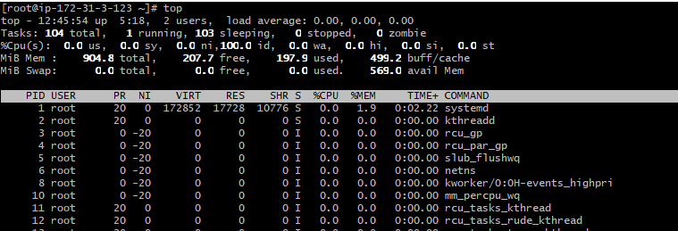

**Explanation:**
Live view of CPU, memory usage, and running processes.

---

## **More Advanced Process Monitor**

```bash
sudo dnf install -y htop

htop
```
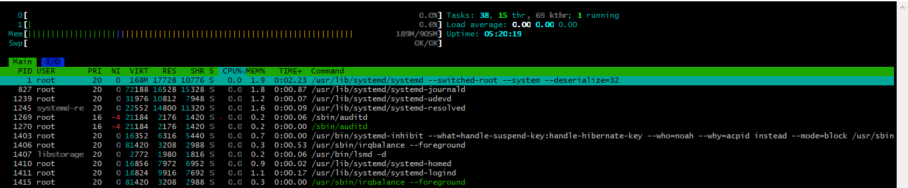

**Explanation:**
Interactive version of `top` (if installed) with colors and easy navigation.

---

## **Check Memory Usage**

```bash
free -h
```

**Explanation:**
Shows RAM usage in human-readable format.

---

## **Check Disk Usage**

```bash
df -h
```

**Explanation:**
Shows disk usage for all mounted filesystems.

---

## **Check System Load Average**

```bash
uptime
```
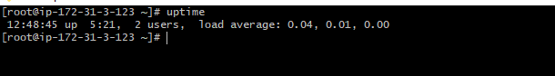

**Explanation:**
Shows load average — useful to know if the server is overloaded.

---

## **Check Service Status**

```bash
systemctl status nginx
```

**Explanation:**
Shows if a service is running, failed, or stopped.

---

## **Start / Stop / Restart Services**

```bash
sudo systemctl start nginx
sudo systemctl stop nginx
sudo systemctl restart nginx
```

**Explanation:**
Used daily by DevOps engineers during troubleshooting.

---

## **Check Open Ports**

```bash
sudo netstat -tulnp
```
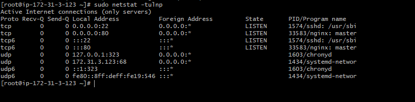

**Explanation:**
Shows which services are listening on which ports.

---

## **Check Listening Service (Method 2)**

```bash
sudo ss -tulnp
```
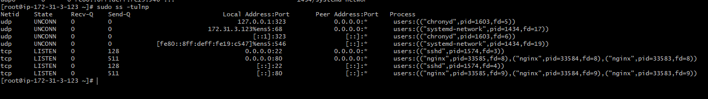

**Explanation:**
Newer, faster version of netstat.

# **Level 3 – Advanced (Production-Ready Linux Admin)**

### ✔ Create custom systemd service for your application

### ✔ SSH hardening for security

### ✔ LVM setup for storage scaling

### ✔ Configure firewall rules

### ✔ Configure logrotate for application logs

---

# **1. Create Custom systemd Service for Your Application**

---

## **Create a systemd service file**

```bash
sudo nano /etc/systemd/system/myapp.service
```

**Explanation:**
You create a service file that systemd will use to start/stop/manage your app like a real Linux service.

---

## **Example systemd service**

```ini
[Unit]
Description=My Custom Application
After=network.target

[Service]
ExecStart=/usr/bin/python3 /opt/myapp/app.py
Restart=always
User=ubuntu
Group=ubuntu

[Install]
WantedBy=multi-user.target
```

**Explanation:**

* **ExecStart** → command to start your app
* **Restart=always** → auto-restart if app crashes
* **After=network.target** → start only after network is ready
* **multi-user.target** → run at system boot

---

## **Reload systemd to apply changes**

```bash
sudo systemctl daemon-reload
```

**Explanation:**
Reloads systemd to read new/updated service files.

---

## **Start the service**

```bash
sudo systemctl start myapp
```

## **Enable the service on boot**

```bash
sudo systemctl enable myapp
```

## **Check service status**

```bash
sudo systemctl status myapp
```

**Explanation:**
Shows logs, errors, and service health.

---

# **2. SSH Hardening (Security Best Practices)**

---

## **Open SSH config file**

```bash
sudo nano /etc/ssh/sshd_config
```

### **Recommended changes:**

---

### **Disable root login**

```conf
PermitRootLogin no
```
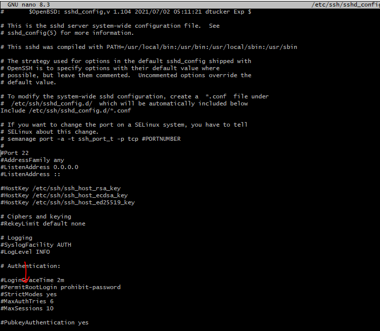

**Explanation:**
Prevents direct root login → reduces risk of brute-force attacks.

---

### **Disable password authentication (use keys only)**

```conf
PasswordAuthentication no
```
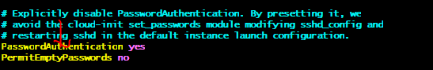

**Explanation:**
Only allow SSH key-based login → more secure.

---

### **Change default SSH port**

```conf
Port 2222
```
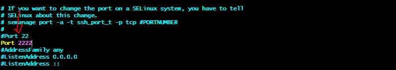

**Explanation:**
Avoids default port 22 — reduces automated attacks.

---

### **Restart SSH service**

```bash
sudo systemctl restart sshd
```

**Explanation:**
Applies the new security settings.

---

# **3. LVM Setup (Logical Volume Manager)**

Used for **storage scaling**, adding disks **without downtime**.

---

## **List available disks**

```bash
lsblk
```
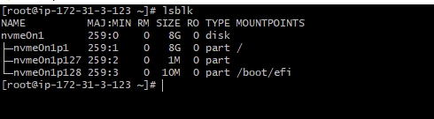

**Explanation:**
Helps identify the disk you want to use for LVM (e.g., /dev/xvdf).

---
# ✅ **Install LVM2 on Amazon Linux 2023**


```bash
sudo dnf install -y lvm2
```
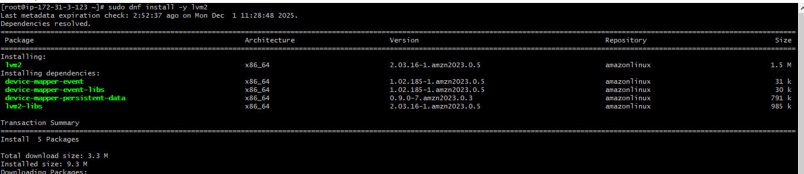

After installation, verify:

```bash
pvcreate --version
```

Now you can use:

```bash
sudo pvcreate /dev/xvdf
sudo vgcreate myvg /dev/xvdf
sudo lvcreate -l 100%FREE -n mylv myvg
```

## **Create a Physical Volume (PV)**

```bash
sudo pvcreate /dev/nvme1n1

```
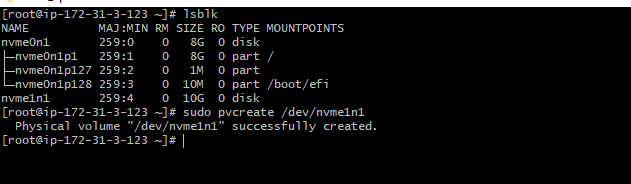


**Explanation:**
Marks disk as usable by LVM.

---

## **Create a Volume Group (VG)**

```bash
sudo vgcreate appvg /dev/nvme1n1

```
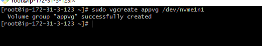

**Explanation:**
This creates a VG named `appvg` using your attached 10GB disk.

---

## **Create a Logical Volume (LV)**

```bash
sudo lvcreate -L 10G -n applv appvg
```
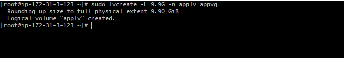

**Explanation:**
Creates a 10GB logical volume named `applv` inside `appvg`.

---

## **Create filesystem**

```bash
sudo mkfs.ext4 /dev/appvg/applv
```
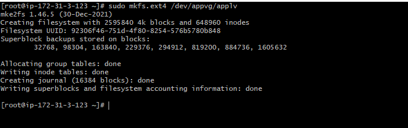

**Explanation:**
Formats the LV with ext4 filesystem.

---

## **Mount it**

```bash
sudo mkdir /mnt/appdata
sudo mount /dev/appvg/applv /mnt/appdata
```

**Explanation:**
Makes storage usable at `/mnt/appdata`.

---

## **Extend an LV (Increase Size)**

```bash
sudo lvextend -L +5G /dev/appvg/applv
sudo resize2fs /dev/appvg/applv
```

**Explanation:**
Grows LV by 5GB and expands filesystem **without downtime**.

---

# **4. Configure Firewall Rules (UFW / Firewalld)**

---

## **Using UFW (Ubuntu)**

### **Allow SSH**

```bash
sudo ufw allow 22
```

### **Allow a port (e.g., Nginx)**

```bash
sudo ufw allow 80
sudo ufw allow 443
```

### **Enable firewall**

```bash
sudo ufw enable
```

### **Check status**

```bash
sudo ufw status
```

**Explanation:**
Displays allowed/blocked ports.

---

## **Using Firewalld (RHEL/CentOS/Amazon Linux)**

## **1. Install firewalld**

```bash
sudo dnf install firewalld -y
```
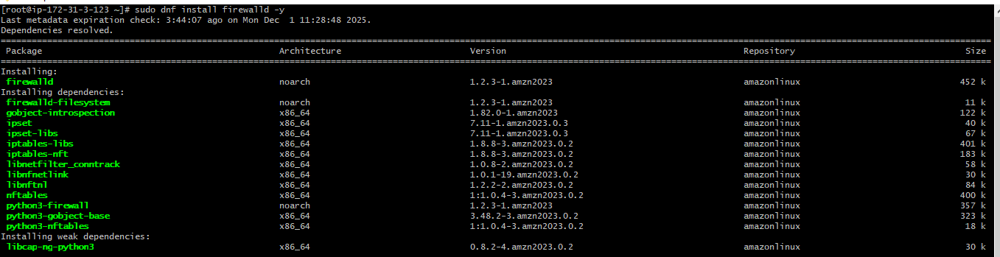
---

## **2. Start and enable firewalld**

```bash
sudo systemctl start firewalld
sudo systemctl enable firewalld
```

Check the status:

```bash
sudo systemctl status firewalld
```
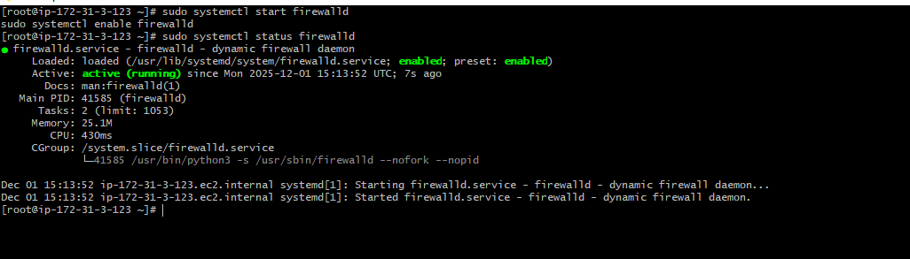

You should see it **active (running)**.


### **Allow services**

```bash
sudo firewall-cmd --add-service=http --permanent
sudo firewall-cmd --add-service=https --permanent
```
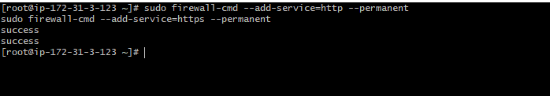

### **Open a port**

```bash
sudo firewall-cmd --add-port=8080/tcp --permanent
```

### **Reload firewall**

```bash
sudo firewall-cmd --reload
```

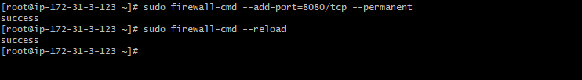

**Explanation:**
Applies changes and activates new firewall rules.

---

# **5. Implement Logrotate for Application Logs**

---

### **1. Create the log directory**

```bash
sudo mkdir -p /var/log/myapp
```

* `-p` ensures the parent directories are created if missing.

---

### **2. Set correct ownership**

Replace `ec2-user` with the user your app runs as (or `root` if the app runs as root):

```bash
sudo chown ec2-user:ec2-user /var/log/myapp
```

---

### **3. (Optional) Create a sample log file**

```bash
sudo touch /var/log/myapp/myapp.log
sudo chown ec2-user:ec2-user /var/log/myapp/myapp.log
```

* This allows you to **test logrotate immediately**.

---

### **4. Fix your logrotate config**

Edit `/etc/logrotate.d/myapp` and make sure:

```text
/var/log/myapp/*.log {
    daily
    rotate 7
    compress
    missingok
    notifempty
    create 0644 ec2-user ec2-user
}
```

* `missingok` → avoids errors if logs don’t exist yet.
* `create` → ensures rotated logs are created with proper ownership.

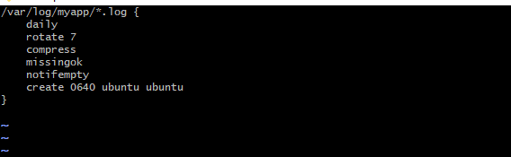
---

### **5. Test logrotate**

```bash
sudo logrotate -v /etc/logrotate.d/myapp
```
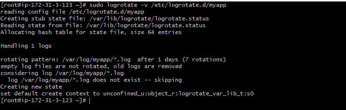

You should see it processing the log files without errors.

---

## **Force run logrotate**

```bash
sudo logrotate -f /etc/logrotate.d/myapp
```

**Explanation:**
Manually rotates logs immediately.


